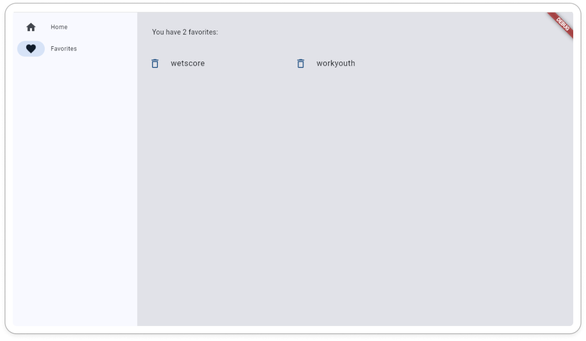

# Flutter-First 

- Descrição

    - Repositório para projeto inicial de flutter e futuros estudos baseados na linguagem. 

    - Referência do tutorial utilizado:
    https://docs.flutter.dev/get-started/codelab

# O que foi feito:

Criação de app que faz junção de duas palavras aleatórias e e as exibe em lista, possibilitando a adição e remoção de palavras favoritas. 




## Como rodar o projeto

- Primeiramente é necessário ter as configurações do flutter instaladas, você pode seguir o passo a passo na documentação:
https://docs.flutter.dev/get-started/install

- Com o ambiente configurado basta acessar o diretório onde está o projeto e executar o comando ```flutter run```, você poderá escolher em qual dispostivo executar (caso você tenha instalado os emuladores de mobile você poderá executar o app por eles, como fiz os testes em web optei por usar o chrome);


- Caso tiver algum problema na execução você pode rodar o comando ```flutter doctor``` para verificar se existe alguma pendência na     configuração do flutter em sua máquina.

    